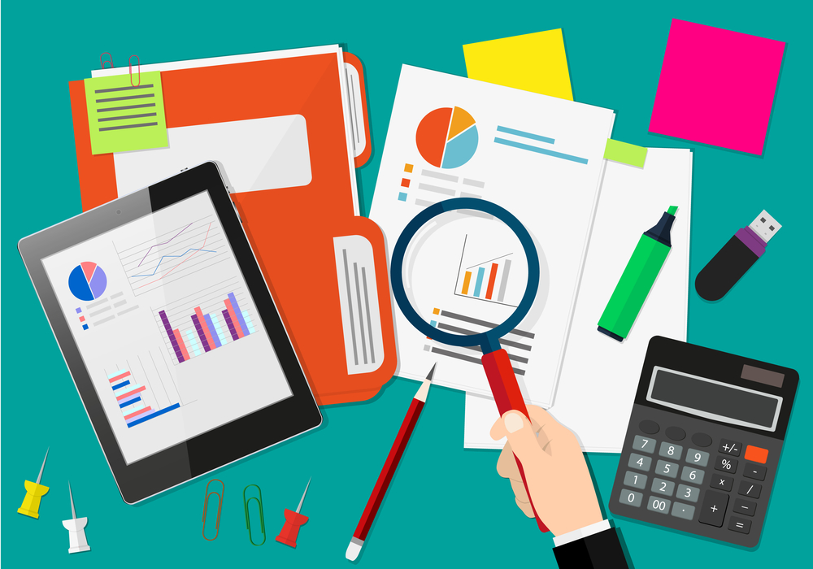
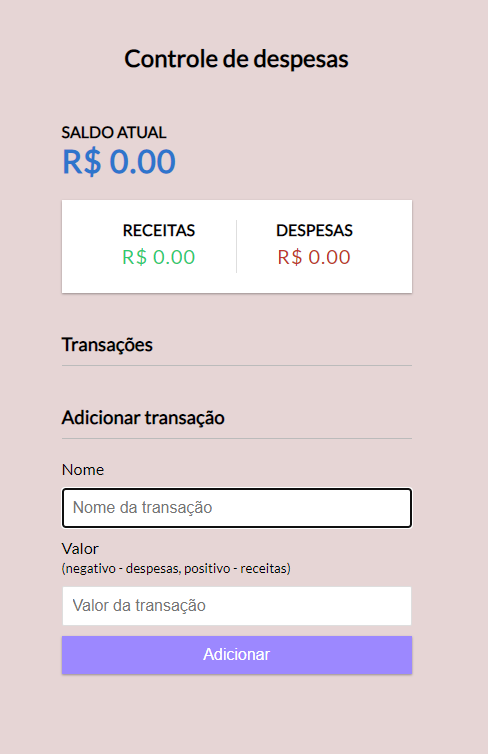

## Controle de Despesas

  

  

### O principal benefício de fazer seu controle de despesas é, como o nome já diz, ter controle sobre o seu dinheiro. Quando você olha para o quanto gasta, para o quanto recebe e procura entender o quanto é possível economizar, você conhece sua real situação financeira.

  

<td align="center"><a href="https://github.com/elisabetealves"> <b>Elisabete Alves</b></a> <a target="_blank" href="https://www.linkedin.com/mwlite/in/elisabete-alves-675637135">LinkedIn</a> </td>    

## 📝 Licença

Este projeto esta sob a licença [MIT](./LICENSE).

